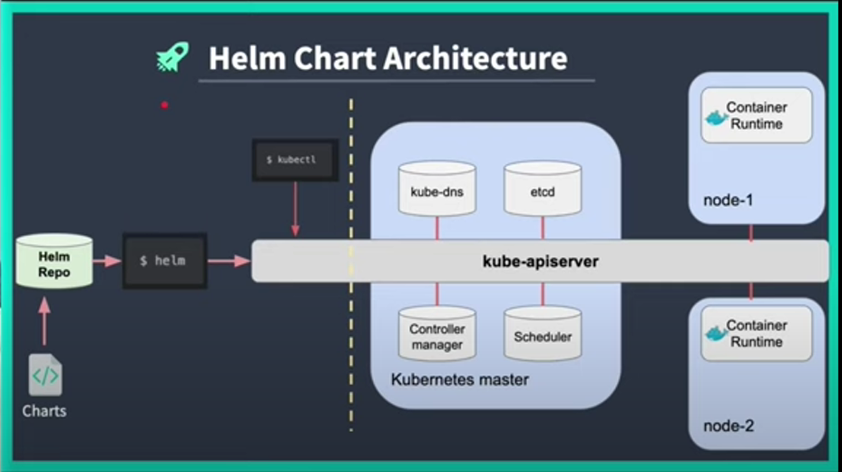

What is Helm Chart?

- Basic Building Block is the Docker Container
- Docker Container helps package any aplication e.g python appllication, java application etc
  -You can then ship the conatiner to anywhere or deploy to a Prod environment

Helm Chart provides a top layer abstraction so that you can run a minimal helm chart command which can internally communicate with our kubernetes cluster and can produce same results in a more efficient way.

# Kubernetes As a Service

1. AKS - Azure Kubernetes Services
2. EKS - Elastic Kubernets Service
3. GKE - Google Kubernetes Engine
4. microK8s - Free

## SET UP microK8s on Mac M1

1. Install microK8s

   - Go To https://microk8s.io/#install-microk8s
   - Select which OS you installing for and follow instructions
     ** brew install ubuntu/microk8s/microk8s
     ** microk8s install

2. Install kubectl on mac M1
   - Go to https://kubernetes.io/docs/tasks/tools/install-kubectl-macos/
   - curl -LO "https://dl.k8s.io/release/v1.28.2/bin/darwin/arm64/kubectl"

## How to Install Helm chart

# Pre-requisites
_ One running kubernetes cluster (any of the following)
a. EKS - Amazon Elastic k8s Service
b. GKE - Google k8s engine
c. AKS - Azure Kubernets Service
d. microk8s - k8s for development

# Installation of Helm Chart
_ Go to https://jhooq.com/getting-start-with-helm-chart/

## HELM ARCHITECTURE

  

## Helm CLI(Commands)

* Basic Helm CLI Commands
    * > helm install myhelloworld helloworld
    * > helm delete myhelloworld
    * > helm list -a

## Creating a Helm Chart
    * helm create  hellowworld
    * ls -lart
    * cd ./helloworld
    * ls
    * cd templates
    * lstrelo

**NB Remember to do a port foward for your pod if it does not work in 
 > kubectl port-foward <pod_name>  <machine_port>:<pod_port/container_port>

 To view Dashboard
 > microk8s dashboard-proxy

 To uninstall Helm chart
 > helm uninstall <chart_name>

## HELM CHART COMMAND EXPLANATION

* Create Helm chart
  > helm create <chart_name>
  * used for creating the chart

* Install Helm Chart
  > helm install <release_name> <chart_name>
  *

* Upgrade the helm chart
  > helm upgrade <release_name> <chart_name>

* Rollback the helm chart
  > helm rollback <release_name> <Revision_Number>
  * When rolling back provide the revision number you are rolling back to

  # 5. Helm --debug -dry-run
  * Used to validate your helm chart before install
  >helm install myhelloworld --debug --dry-run helloworld

  

  

  # 6. Helm template
    * used to validate the yml without connecting to thek8s api server

      

  

# 7. Helm Lint
* Find any errors or misconfiguration
  > helm lint <chart_name>

# 8. Helm Lint
* Remove the chart
  > helm uninstall <release_name>

  ## CHECKING HELM SERVICE URL IN MACBOOK M1
  * You can get the below commands after running >> helm install <release_name> <helm_chart>
  > export NODE_PORT=$(kubectl get --namespace default -o jsonpath="{.spec.ports[0].nodePort}" services myhelloworld)
  > export NODE_IP=$(kubectl get nodes --namespace default -o jsonpath="{.items[0].status.addresses[0].address}")
  > echo http://$NODE_IP:$NODE_PORT

